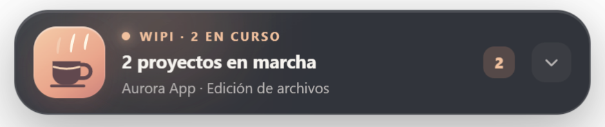
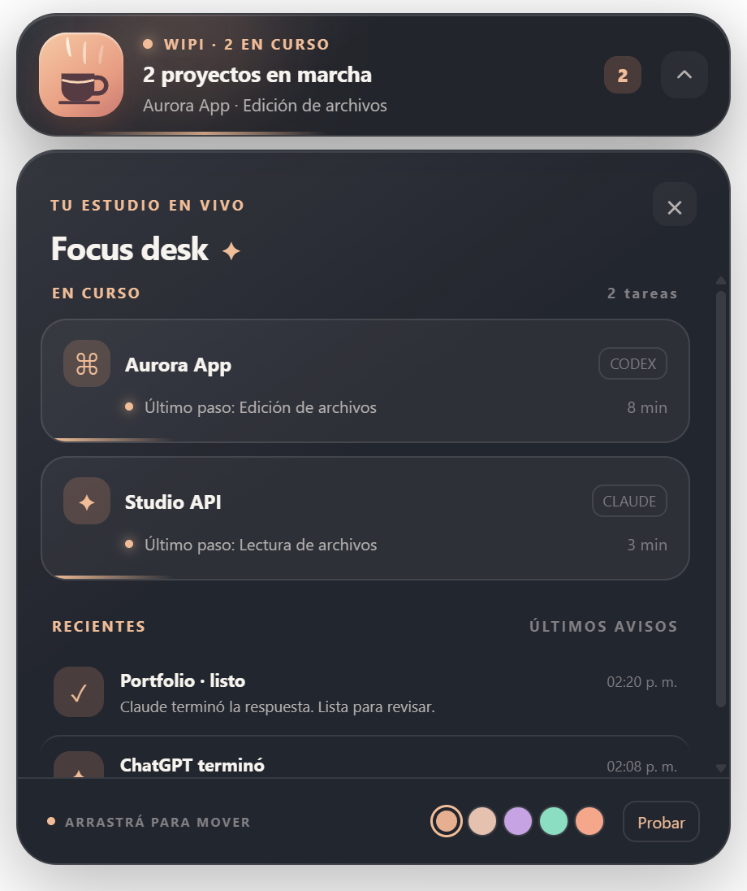

# Wipi ☕

**Idioma:** [English](README.md) · Español

**Un pequeño focus desk para Windows.** Seguí varias tareas de Codex sin cambiar de ventana y recibí avisos suaves cuando terminan. La barra tiene una taza con vapor animado, cinco temas y una posición que podés elegir arrastrándola.



<details>
<summary>Ver el panel de actividad</summary>



También está disponible el [tema claro Pearl](docs/images/wipi-pearl.png).

</details>

> Las imágenes usan nombres ficticios. No contienen conversaciones ni proyectos reales.

## Inicio rápido (Windows)

1. [Descargá el instalador Wipi 0.2.0](releases/v0.2.0/Wipi-Setup-0.2.0.exe) y ejecutalo. Por ahora, el instalador no tiene firma de código.
2. Abrí **Wipi** desde el menú Inicio. Aparecerán la barra flotante y el icono en la bandeja.
3. Pulsá la flecha para abrir el panel y después **Probar** para comprobar los avisos. Las tareas de Codex aparecen automáticamente cuando Codex guarda sesiones locales.

El instalador está en la [carpeta versionada](releases/v0.2.0/) con su suma SHA-256. El puente `notify` de Codex CLI y la extensión de ChatGPT web son opcionales; sus instrucciones están más abajo.

## Qué podés hacer

- Ver cuántas tareas de Codex siguen en curso y a qué proyecto pertenecen.
- Consultar el último paso registrado: análisis, comandos, herramientas, edición o respuesta. Es una señal de actividad, no un porcentaje de avance.
- Recibir un aviso breve cuando termina una tarea y revisar los últimos 30 avisos mientras Wipi está abierto.
- Arrastrar la barra a cualquier parte del escritorio. Wipi recuerda la posición; desde el icono de la bandeja podés devolverla arriba al centro.
- Cambiar entre **Graphite**, **Pearl**, **Violet**, **Mint** y **Sunset**. El menú de la bandeja también permite probar un aviso, activar el inicio con Windows y salir.

## Integraciones disponibles

| Fuente | Tareas en curso | Aviso al terminar | Configuración |
| --- | --- | --- | --- |
| Codex Desktop | Sí, desde sesiones locales | Sí | Automática si Codex guarda sesiones en el equipo |
| Codex CLI | Sí, cuando escribe sesiones locales | Sí | El puente `notify` es opcional para incluir un resumen de la respuesta |
| ChatGPT web | Aún no | Sí, con la extensión incluida | Cargar la extensión en Chrome o Edge |
| ChatGPT Desktop | Aún no | Aún no | No disponible |

Wipi lee los eventos locales de Codex cada 2,5 segundos. Una sesión sin cambios durante diez minutos aparece como **Sin actividad reciente** y deja de contar como tarea activa. El último paso mostrado es el último evento registrado, no una lectura exacta de lo que Codex está haciendo en ese instante.

## Empezar

### Usar desde el código

Probado en Windows con Node.js 24 y npm 11. Cloná o descargá el repositorio y abrí PowerShell en su carpeta:

```powershell
npm.cmd ci
npm.cmd start
```

La primera ejecución puede descargar el runtime de Electron. Wipi aparecerá como una barra flotante y un icono en la bandeja del sistema.

### Crear los ejecutables

```powershell
npm.cmd run dist
```

El comando crea un instalador y una versión portable en `dist/`. Esa carpeta se excluye de Git. El instalador 0.2.0 también está en `releases/v0.2.0/`, seguido con Git LFS porque supera el límite habitual de tamaño de GitHub. Adjuntalo a una **GitHub Release** para facilitar la descarga desde el navegador. Las compilaciones actuales no tienen firma de código.

### Conectar Codex CLI con `notify` (opcional)

Con Wipi abierto, desde la raíz del repositorio:

```powershell
node scripts\install-codex-hook.js
```

El script modifica el `config.toml` del usuario, crea `config.toml.wipi-backup` y conserva cualquier comando `notify` anterior. Reiniciá Codex CLI para que tome la configuración. Mantené el repositorio en la misma ruta: el hook guarda la ruta absoluta de `scripts/codex-notify.js`.

### Conectar ChatGPT web (opcional)

1. En Chrome abrí `chrome://extensions`; en Edge, `edge://extensions`.
2. Activá **Modo de desarrollador** y elegí **Cargar descomprimida**.
3. Seleccioná la carpeta `chatgpt-extension/` de este repositorio.
4. En la bandeja de Windows, abrí el menú de Wipi y elegí **Abrir carpeta de configuración**.
5. Copiá el valor `token` de `settings.json` en la extensión. Pulsá **Guardar** y **Probar**.

La extensión avisa cuando termina una respuesta en `chatgpt.com`. No envía el texto de la conversación. Su detección depende de la interfaz de ChatGPT web y puede necesitar ajustes si esa interfaz cambia.

## Documentación

- [Guía de instalación y uso](docs/installation.md)
- [Integraciones y estados](docs/integrations.md)
- [Privacidad y seguridad local](docs/privacy.md)
- [Desarrollo y capturas](docs/development.md)
- [Ideas para próximas versiones](docs/roadmap.md)
- [Índice de documentación](docs/README.md)

## Límites actuales

- No mide porcentajes de progreso. Procesa los archivos de sesión de Codex localmente para extraer estados, pero no muestra ni envía el contenido de las conversaciones.
- No detecta tareas en curso de ChatGPT web ni avisos de la app ChatGPT Desktop.
- La integración de Codex Desktop usa el formato local de sus sesiones; podría cambiar con una actualización de Codex.
- El historial de avisos vive en memoria y se vacía cuando se cierra Wipi.

Si encontrás un fallo, adjuntá la versión de Windows y Wipi, la fuente del aviso y los pasos para reproducirlo. **No adjuntes** `settings.json`, tokens ni conversaciones completas.

## Licencia

[MIT](LICENSE). Wipi es un proyecto independiente y no está afiliado a OpenAI.
