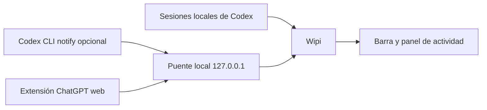

# Integraciones y estados

## Vista general

Wipi combina señales locales. No consulta una API de OpenAI, no necesita iniciar sesión y no ofrece una medida de progreso en porcentaje.

## Codex Desktop y Codex CLI

El monitor lee archivos JSONL recientes de `CODEX_HOME\sessions` o, si esa variable no existe, de `%USERPROFILE%\.codex\sessions`. Observa los directorios de hoy y ayer cada 2,5 segundos.

| Señal local | Lo que Wipi muestra |
| --- | --- |
| `session_meta` / `turn_context` | Proyecto a partir de la carpeta de trabajo y fuente aproximada. |
| `task_started` | Nueva tarjeta en **En curso**. |
| `item_completed` | Tipo del último paso registrado: análisis, comandos, herramientas, edición, respuesta o búsqueda. |
| `task_complete` | La tarjeta deja de estar activa y aparece un aviso de finalización. |

**Último paso** significa literalmente el último evento reconocido. No indica qué operación está ejecutándose ahora ni cuánto falta. Si no hay actividad durante diez minutos, Wipi marca la tarjeta **Sin actividad reciente** y la excluye del contador. Después de una hora sin cambios deja de mostrarla. El panel muestra como máximo doce sesiones recientes en curso.

El formato de estas sesiones pertenece a Codex y puede variar entre versiones. Una sesión muy grande o una ejecución que no escriba estos eventos puede quedar incompleta o no aparecer.

### Hook oficial de Codex CLI

El ajuste de usuario `notify` ejecuta `scripts/codex-notify.js` con un argumento JSON cuando Codex emite `agent-turn-complete`. El script reenvía el comando `notify` que hubiera antes y envía el aviso a Wipi por `127.0.0.1:47823`. El hook es opcional; puede aportar un resumen breve del último mensaje. [Documentación oficial de Codex](https://learn.chatgpt.com/docs/config-file/config-advanced#notifications).

Wipi evita duplicar un aviso cuando el evento de sesión y el hook incluyen el mismo identificador de turno.

## ChatGPT web

La extensión incluida observa `chatgpt.com`. Cuando detecta que terminó una nueva respuesta del asistente, envía a Wipi un aviso fijo. **No envía el texto del chat.** Necesita cargarse manualmente en Chrome o Edge y guardar el token local de Wipi.

La detección depende de elementos de la página y puede dejar de funcionar si ChatGPT web cambia. La extensión no muestra tareas en curso. ChatGPT Desktop no tiene integración en esta versión.

## Avisos externos

Wipi expone `POST http://127.0.0.1:47823/notify` solo en loopback. Requiere el encabezado `X-Wipi-Token` con el valor local de `%APPDATA%\wipi\settings.json`. Acepta un JSON con `source` (`codex`, `codex-cli`, `chatgpt` o `test`), `title` y `body`; limita la longitud del texto. Esta interfaz es local y no se debe publicar en una red.
