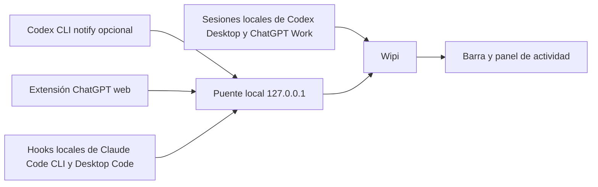

# Integraciones y estados

## Vista general

Wipi combina señales locales. No consulta una API de OpenAI, no necesita iniciar sesión y no ofrece una medida de progreso en porcentaje.

## ChatGPT para Windows, Codex Desktop y Codex CLI

El monitor lee archivos JSONL recientes de `CODEX_HOME\sessions` o, si esa variable no existe, de `%USERPROFILE%\.codex\sessions`. Observa los directorios de hoy y ayer cada 2,5 segundos.

| Señal local | Lo que Wipi muestra |
| --- | --- |
| `session_meta` / `turn_context` | Proyecto a partir de la carpeta de trabajo y fuente. `codex_work_desktop` se muestra como ChatGPT; `Codex Desktop`, como Codex. |
| `task_started` | Nueva tarjeta en **En curso**. |
| `item_completed` | Tipo del último paso registrado: análisis, comandos, herramientas, edición, respuesta o búsqueda. |
| `task_complete` | La tarjeta deja de estar activa y aparece un aviso de finalización. |
| `turn_aborted` | La tarjeta deja de estar activa y aparece un aviso de interrupción. |

**Último paso** significa literalmente el último evento reconocido. No indica qué operación está ejecutándose ahora ni cuánto falta. Si no hay actividad durante diez minutos, Wipi marca la tarjeta **Sin actividad reciente** y la excluye del contador. Después de una hora sin cambios deja de mostrarla. El panel muestra como máximo doce sesiones recientes en curso.

El formato de estas sesiones pertenece a Codex y puede variar entre versiones. Una sesión muy grande o una ejecución que no escriba estos eventos puede quedar incompleta o no aparecer.

En ChatGPT para Windows, esto cubre las tareas **Work locales** que guardan sesiones de Codex. Los chats normales, las tareas en la nube y las notificaciones de Windows de la app no generan necesariamente estos archivos, por lo que Wipi no los muestra. ChatGPT ofrece [notificaciones de escritorio y una vista de Actividad](https://learn.chatgpt.com/docs/notifications) para seguir esos chats dentro de su propia app.

### Hook oficial de Codex CLI

El ajuste de usuario `notify` ejecuta `scripts/codex-notify.js` con un argumento JSON cuando Codex emite `agent-turn-complete`. El script reenvía el comando `notify` que hubiera antes y envía el aviso a Wipi por `127.0.0.1:47823`. El hook es opcional; puede aportar un resumen breve del último mensaje. [Documentación oficial de Codex](https://learn.chatgpt.com/docs/config-file/config-advanced#notifications).

Wipi evita duplicar un aviso cuando el evento de sesión y el hook incluyen el mismo identificador de turno.

## Claude Code CLI y Claude Desktop Code

Los [hooks oficiales de Claude Code](https://code.claude.com/docs/en/hooks) se aplican a la CLI y a la pestaña **Code** de [Claude Desktop](https://code.claude.com/docs/en/desktop) en sesiones locales. Al elegir **Conectar Claude Code** en la bandeja de Wipi, se agregan hooks a `%USERPROFILE%\.claude\settings.json` para estos eventos:

| Hook | Estado en Wipi |
| --- | --- |
| `UserPromptSubmit` | Inicia una tarjeta de proyecto. |
| `PreToolUse` | Actualiza el último paso: comandos, lectura, edición, búsqueda o herramientas. |
| `Stop` | Retira la tarjeta y avisa que la respuesta está lista. |
| `StopFailure` | Retira la tarjeta y avisa que hubo una interrupción. |
| `SessionEnd` | Retira una sesión cerrada sin aviso de finalización. |

El hook de PowerShell envía solo identificador de sesión y turno, carpeta de trabajo, nombre del evento y nombre de la herramienta. No reenvía prompts, entradas de herramientas ni respuestas. Las tarjetas sin eventos recientes pasan a **Sin actividad reciente** después de diez minutos y se retiran después de una hora. Los hooks no cubren Chat ni Cowork de Claude Desktop, ni las sesiones remotas de Code; Wipi tampoco distingue visualmente si una sesión local de Claude Code viene de CLI o Desktop.

## ChatGPT web

La extensión incluida observa `chatgpt.com`. Cuando detecta que terminó una nueva respuesta del asistente, envía a Wipi un aviso fijo. **No envía el texto del chat.** Necesita cargarse manualmente en Chrome o Edge y guardar el token local de Wipi.

La detección depende de elementos de la página y puede dejar de funcionar si ChatGPT web cambia. La extensión no muestra tareas en curso. La integración de tareas Work locales de ChatGPT para Windows usa el monitor de sesiones descrito arriba, no esta extensión.

## Avisos externos

Wipi expone `POST http://127.0.0.1:47823/notify` solo en loopback. Requiere el encabezado `X-Wipi-Token` con el valor local de `%APPDATA%\wipi\settings.json`. Acepta un JSON con `source` (`codex`, `codex-cli`, `claude`, `chatgpt` o `test`), `title` y `body`; limita la longitud del texto. El hook de Claude usa `POST /claude-hook` con el mismo token y solo los metadatos indicados arriba. Esta interfaz es local y no se debe publicar en una red.
